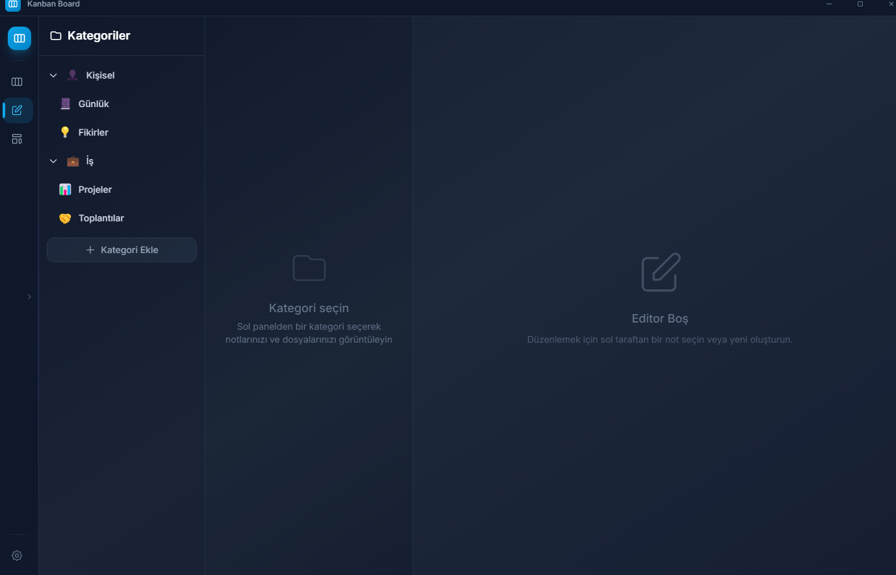

<div align="center">

# 🎯 Personal Project Editor

<p align="center">
  
</p>

### A Modern, Elegant and Powerful Personal Project Management Tool

[](https://www.electronjs.org/)
[](https://reactjs.org/)
[](https://vitejs.dev/)
[](https://tailwindcss.com/)

<p align="center">
  <strong>Built with Electron + Vite + React + Tailwind CSS</strong>
</p>

---

</div>

## 📸 Screenshots

<div align="center">
  
  <p><em>📋 Kanban Board - Easily manage your tasks</em></p>
  
  <br/>
  
  
  <p><em>📝 Rich Text Editor - Write your notes in style</em></p>
</div>

---

## ✨ Features

<table>
  <tr>
    <td width="50%">
      <h3>📋 Kanban Board</h3>
      <ul>
        <li>Drag & Drop card management</li>
        <li>Colorful labels and categories</li>
        <li>Priority levels (Low, Medium, High)</li>
        <li>Card detail modal</li>
        <li>To-do lists</li>
        <li>Card image attachment</li>
        <li>🗑️ Trash bin drop zone</li>
      </ul>
    </td>
    <td width="50%">
      <h3>📝 Notebook</h3>
      <ul>
        <li>Rich text editor (Quill)</li>
        <li>Heading, bold, italic formatting</li>
        <li>Bullet and numbered lists</li>
        <li>Code blocks</li>
        <li>Auto-save</li>
        <li>Elegant dark theme</li>
      </ul>
    </td>
  </tr>
  <tr>
    <td width="50%">
      <h3>🏗️ Architecture Canvas</h3>
      <ul>
        <li>Shape insertion (Rectangle, Circle, etc.)</li>
        <li>Connection lines</li>
        <li>Drag & Drop editing</li>
        <li>Zoom and pan controls</li>
        <li>Copy & Paste</li>
        <li>Right-click context menu</li>
      </ul>
    </td>
    <td width="50%">
      <h3>🎨 Theme System</h3>
      <ul>
        <li>6 Different theme options</li>
        <li>8 Accent colors</li>
        <li>Dynamic frame colors</li>
        <li>Custom title bar</li>
        <li>Collapsible sidebar</li>
        <li>Persistent settings with LocalStorage</li>
      </ul>
    </td>
  </tr>
</table>

---

## 🚀 Installation

```bash
# Clone the repository
git clone https://github.com/yamacacan/PersonalProjectEditor.git

# Navigate to the project directory
cd PersonalProjectEditor

# Install dependencies
npm install

# Run in development mode
npm run electron:dev
```

## 📦 Production Build

```bash
# Build for Windows
npm run electron:build:win

# Build for macOS
npm run electron:build:mac

# Build for Linux
npm run electron:build:linux
```

> 📁 Build files are generated in the `release/` folder.

---

## 🛠️ Technologies

<div align="center">

| Technology | Version | Description |
|:---------:|:--------:|:-----------|
|  | 28.x | Desktop application framework |
|  | 18.x | UI library |
|  | 5.x | Build tool |
|  | 3.x | CSS framework |
|  | 24.x | Packaging tool |

</div>

---

## 📁 Project Structure

```
PersonalProjectEditor/
├── 📁 build/               # Build resources and icons
├── 📁 electron/
│   ├── main.js            # Electron main process
│   └── preload.js         # IPC bridge
├── 📁 src/
│   ├── 📁 components/
│   │   ├── KanbanBoard.jsx    # Kanban board
│   │   ├── NoteEditor.jsx     # Note editor
│   │   ├── ProjectCanvas.jsx  # Architecture canvas
│   │   ├── Settings.jsx       # Settings page
│   │   ├── TitleBar.jsx       # Custom title bar
│   │   ├── Sidebar.jsx        # Navigation sidebar
│   │   └── Trashhold.jsx      # Trash bin drop zone
│   ├── 📁 utils/
│   │   └── storage.js     # Data management
│   ├── App.jsx
│   └── index.css
├── 📁 readmeassets/       # README assets
└── 📄 README.md
```

---

## 💾 Data Storage

Data is safely stored in the user's `userData` directory:

| Platform | Location |
|----------|----------|
| 🪟 Windows | `%APPDATA%/kanban-app/appData/` |
| 🍎 macOS | `~/Library/Application Support/kanban-app/appData/` |
| 🐧 Linux | `~/.config/kanban-app/appData/` |

---

## 🎨 Theme Options

<div align="center">

| Theme | Appearance |
|:-----:|:----------:|
| 🌑 Dark | Slate tones, classic dark theme |
| 🌙 Night Blue | Indigo accent, night atmosphere |
| 🌊 Ocean | Cyan tones, refreshing ocean theme |
| 🌲 Forest | Green tones, natural forest theme |
| 🌅 Sunset | Red tones, warm sunset |
| 💜 Purple Dream | Purple tones, elegant and modern |

</div>

---

## 👤 Developer

<div align="center">
  
### Ahmet Can Yamaç

[](mailto:yamacahmetcan@gmail.com)
[](https://github.com/yamacacan)

</div>


<div align="center">

### ⭐ Don't forget to star this project if you liked it!

<br/>

Organize your projects with **Personal Project Editor**! 🚀

<br/>

*© 2026 Ahmet Can Yamaç. All rights reserved.*

</div>
